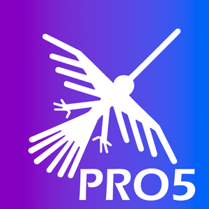

# **Facturador PRO 7**


## Términos y condiciones del uso de este repositorio

1.- Este repositorio es de código abierto pero de acceso privado, se permite la distribución y/o modificaciones si se hace referencio a la casa matriz del desarrollo de este es software es [https://facturaloperu.com](https://facturaloperu.com)

2.- Esta sección de términos y condiciones no puede ser removida al compartir o distribuir el repositorio de alguna forma, de hacerlo, [https://facturaloperu.com](https://facturaloperu.com) se reserva el derecho de remover el acceso y limitar el uso a quien lo distribuya de esa forma o a quien se atribuya el desarrollo del mismo.

3.- Si desea distribuir el código fuente como propio, debe tener al menos un 30% de modificaciones en todo el código, y previamente debe validarse dicho % por [https://facturaloperu.com](https://facturaloperu.com)

4.- El uso del software a nivel funcional es marca blanca, sin embargo a nivel de distribución del código fuente, debe contener esta sección de términos y condiciones.

5.- [https://facturaloperu.com](https://facturaloperu.com) no se hace responsable por los daños o perjuicios del uso del código de este software cuando no ha sido distribuido directamente por [https://facturaloperu.com](https://facturaloperu.com)

## Manuales de Instalación

[Windows ](https://docs.google.com/document/d/1_s2El7B8IZpNFfbnIXjCUrhUjPUM6bT3/edit?usp=sharing&ouid=105852058831627260857&rtpof=true&sd=true "Clic")
<br>
[Docker - Linux](https://docs.google.com/document/d/1eKZwozEZkDKjYMSkQG_oFdMbnMVYlMfkQK-BfCNTm5w/edit?usp=sharing "Clic")
<br>
[Docker - Linux - SSL](https://docs.google.com/document/d/1V54AoYPSNqgi2M9ddck6gh3AgQspZ-eH37_1BU7Gpuo/edit?usp=sharingg "Clic")
<br>
[Valet - Linux](https://docs.google.com/document/d/1x1SZnhzDITta6k-pOQC75xQKWowCgSUSRoa434gglQA/edit?usp=sharing "Clic")
<br>
[Linux - gestión externa de SSL](https://docs.google.com/document/d/1D87YJ9fq9yHiAauu6SGVugiC3m_i42DrFUt6VKYXuDI/edit?usp=sharing "Clic")


### Scripts de instalación con Docker

Linux - Ubuntu 18 - Docker - SSL opcional<br>
[Guia](https://gitlab.com/-/snippets/2079063 "Clic")<br>
[Script](https://gitlab.com/-/snippets/2079063/raw/master/install.sh "Clic")<br>


### Manuales de actualización

* Docker - Comandos manuales

[Con Docker](https://docs.google.com/document/d/1ekGySBjGHspbPEE3OLkMGlWwjLvudmyLKo9Et-Cxejk/edit "Clic")
<br>


### Manuales de actualización de SSL gratuito

* Docker

[SSL](https://docs.google.com/document/d/1kcgtIDrOWnGKQbWO3sW2KEkUoNdadIB5YHBgaSb87uA/edit "Clic") <br>
[Script](https://gitlab.com/b.mendoza/facturadorpro3/-/snippets/1955372/raw/master/updateSSL.sh "Clic") <br>
[Video](https://www.loom.com/share/577a32e168a44cc7afc6e2919589de56 "Clic")


### Manuales de Usuario

[Manual de usuario](https://docs.google.com/document/d/1i7yKGy3rIvv9TrnwRWZifTuZMMnZ8dbWpqcjPZ3ClmE/edit "Clic")<br>
[Manual de Tareas Programadas](https://docs.google.com/document/d/1Cu3Kpgv9HvMAV4fwVNbR-CFc0uTu_-qEVLT-MIuxBTQ/edit?usp=sharing "Clic")<br>
[Manual de Cambio de Entorno (Usuario secundario)](https://docs.google.com/document/d/1IBXczY4b1YvSnGdFlIklpb8HGlQcP1lN44rpXbtYyUc/edit "Clic")<br>
[Manual de Pruebas](https://docs.google.com/document/d/1ht9JS7VdXiZrPmsqe3Dz-325lN_qEHDVVbieYU4Kay8/edit "Clic")

## API

[Descargar colección para Postman](https://drive.google.com/file/d/1-SAGfGuUQx0sm43kNRPZeoP1kx2JisxJ/view?usp=sharing "Clic")<br>
[Documentación - Ver json con respuestas](https://docs.google.com/document/d/1QO3H2nhV6dubGFc-IOrXY1X1hobmKkSmutfrtKbelTw/edit "Clic")<br>

## Pruebas online

### Panel de administración

[URL](https://facturalo.pro "Clic")
<br>
Usuario: admin@gmail.com<br>
Contraseña: 123456

### Panel de cliente

[URL](https://demo.facturalo.pro "Clic")
<br>
Usuario: demo@gmail.com<br>
Contraseña: 123456


## Manuales adicionales

### Conexión
Conexión remota al servidor: [Guía](https://docs.google.com/document/d/1m7xmQ_yLBO2MQVew6ZrlCdvIMLNg2_EzEJmntDM_Jms/edit?usp=sharing "Clic")<br>
Guía acceso SSH - Putty: [Guía](https://docs.google.com/document/d/1PmQejvNd_dkXVm8DPUYlQTag0wvES46tMpxX3MPhkNY/edit# "Clic")<br>
Conexión servidor Winscp: [Guía](https://docs.google.com/document/d/1Xpri2102N4b5C-dG-FVPXW5ZWjEz5S4iDjpvl7Zwq2E/edit# "Clic")<br>
Montar proyecto en /home: [Guía](https://docs.google.com/document/d/12o5dp0eccGgraKj3P-ly_wWmIcl2G0gUTZEgVi-AFtk/edit?usp=sharing "Clic")<br>

### Manipulación de archivos dentro del servidor
Documentación del archivo .ENV: [Guía](https://docs.google.com/document/d/1XpNPg32CrihM1wYWjttwON-2R6nln7-70vBLZnD1UjE/edit?usp=sharing "Clic")<br>
Incrementar recursos - servidor: [Guía](https://drive.google.com/open?id=1IQad7UnljZEPd4hYWx5ZlR3LJliFGT25AjiI4-TlcJU "Clic")<br>
Incrementar recursos - aplicación: [Guía](https://drive.google.com/open?id=1_A06M8AKR514XdctOpi8yIHOQd2cMIzm1BAdNCLUoew "Clic")<br>
Configuracion de correo electrónico emisor: [Guía](https://docs.google.com/document/d/1sBXGgKZwcgKZTMTT_qQldpRT13jzEL4Q1S_yPpY-nOo/edit?usp=sharing "Clic")<br>
Configuracion de correo emisor por cliente: [Guía](https://docs.google.com/document/d/1ix2vPsiqSoK9jNAOF2gPjWhNa3BdajU5x8I5aBvEz0o/edit?usp=sharing "Clic")<br>
Manual - Cambio de dominio: [Guía](https://docs.google.com/document/d/14rbElqQ6Ru6hh3UCZm4wTKIUCm_hPbMNYz9EH8fcPRo/edit?usp=sharing "Clic")<br>
Linux - Eliminar temporales: [Guía](https://docs.google.com/document/d/17-9F9xrQepGfSkZIiCcty-B0GAjeJnN5KO8p0rOBYxY/edit?usp=sharing "Clic")<br>
Linux - Eliminar archivos por extensión: [Guía](https://docs.google.com/document/d/1M1s6EYF7sA89JccrXh7d_UhLB367F7Kk41yKCpSIzdo/edit#heading=h.ghi3ru1xdrna "Clic")<br>
Configuración servidor alterno SUNAT: [Guía](https://docs.google.com/document/d/1pr-9ewFYY7JFtYg-0V5MY4R16OGv-02VH5MqXjeUCh0/edit#heading=h.nezjsyganf1w "Clic")<br>
Habilitar debug: [Guía](https://drive.google.com/open?id=1OdU-rDjr_cxM7t3fujBxPnEQn7qMoxIO6KZNjiKzyvU "Clic")<br>
Configuración de API RUC/DNI (APIPERU): [Guía](https://docs.google.com/document/d/15_MjQBamZI20UC08p-zC9N3yrMhIqh8iObikZ_eNKKg/edit?usp=sharing "Clic")<br>
Configuración de tareas programadas (crontab-LAMP): [Guía](https://docs.google.com/document/d/1fv_wWZSbbhEBo_uHiIE80y7PcU3m-A-HhPTPgQBth3Y/edit?usp=sharing "Clic")<br>

### Base de datos
Guía acceso a base de datos: [Guía](https://drive.google.com/open?id=1uZ_qt34I8HucJYmt_RfI2orgfl9_dpqIh8RukwiG1uM "Clic")<br>
Cambiar Contraseña root: [enlace](https://gist.github.com/rordi/ab55c92848fd06884172ed22ae88d7df "clic")<br>

### Docker
Iniciar servicios docker: [Guía](https://docs.google.com/document/d/1MMuyeYE53RjDaOR2OLPsCtpxicDzqowlvoMTWpkBaSM/edit# "Clic")<br>
Guía generar backup: [Guía](https://drive.google.com/open?id=15dD0KPmDPIeM5y6QdLJivEI-ryS75s2uuJJlusNTr1g "Clic")<br>
Restauración de Mysql|Docker: [Guía](https://docs.google.com/document/d/1Aze-O_a0aseyjaDXsD1iHflPr6ptZ8Cq6BWRrs6GhsM/edit?usp=sharing "Clic")<br>

### Servidores
Guía incrementar espacio disco: [Guía](https://docs.google.com/document/d/1hpEQUs9OFha_35yyLb1cMKeluD-dEku5lQsQ3TJFib8/edit "Clic")<br>
Limpiar inodes: [Guía](https://drive.google.com/open?id=1foPKDI3V3Z9uKTjRc2SPSoztVSOBevPAluT2BqFbfxA "Clic")<br>
Migración servidor: [Guía](https://docs.google.com/document/d/1HjAoa2d6mPDVY5lrDxprwfteKrP6n100LeSox_g34Eg/edit "Clic")<br>
Manual de configuración offline: [Guía](https://drive.google.com/open?id=1s9VE08nVjqyKGQ2BiupfQ0yODVBfTfhkSjjZuZLyv38 "Clic")<br>
Habilitar puertos en Google Cloud: [Manual](https://docs.google.com/document/d/1pbCXJyRyR4VOaQ2BE3aJp-3_vhFIp-b6RXnT_6rtw1o/edit?usp=sharing "clic")<br>

### Funcionalidades

ICBPER en POS: [Guía](https://docs.google.com/document/d/1laSobotFxZy7FlKfALxCoIz7OOT_xiid-QuQP2HD68g/edit?usp=sharing "Clic")<br>

### Laragon
Acceso red local - laragon: [Guía](https://docs.google.com/document/d/13kOE5N5LJtCJIr3hswrfNgBYxi9wx07YwUCrAfgyCoQ/edit "Clic")<br>

### Errores comunes
Procedimiento para solucionar error 1033 SUNAT: [Guía](https://docs.google.com/document/d/1V9xyhH4JRJqFf-8zFBG9lOlmy07ts9dZCcJlQFEcFf8/edit# "Clic")<br>

### No clasificados
Recreación de documentos: [Guía](https://drive.google.com/open?id=1_ZvNpA3_IyvEiQ2NSaiW_rsBhVNbK7YD-_l1kbrEGwQ "Clic")<br>
Manual de cambios privados: [Guía](https://drive.google.com/open?id=1ePniWwGvylJDzHTcPOj6E_nQtD_eO6PCReB_xwzOn98 "Clic")<br>
Validador documentos: [Guía](https://docs.google.com/document/d/1v6XpJrEwCx3suRzRsa4-3-kcAghRvS9DHS5esb89SuI/edit "Clic")<br>

## Soporte

* Use Issues como sistema de tickets para añadir sus sugerencias, problemas o inquietudes
* Inconvenientes con facturación serán atendidos con prioridad
* Una vez obtiene acceso al repositorio tendrá un año de vigencia, pasado el año debe renovar su contrato
* Toda instalación es gestionada mediante los canales de Slack
* Nuevas instalaciones o actualizaciones deben ser programadas y gestionadas, para ser ejecutada el mismo día debe haber un problema previo

## FacturaloPeru

[facturaloperu.com](http://facturaloperu.com "Clic")<br>
soporte@facturaloperu.com<br>
wsapp: 930 973 902<br>

---

# 🚀 Configuración de Desarrollo y Deployment (SafeBillPro)

## 📚 Documentación Adicional

- **[SETUP-LOCAL.md](./SETUP-LOCAL.md)** - Guía completa para configurar el ambiente de desarrollo local en Mac
- **[DEPLOYMENT.md](./DEPLOYMENT.md)** - Guía de CI/CD y deployment automático con GitHub Actions

## ⚡ Quick Start para Desarrollo Local

### Ambiente de Desarrollo (Mac con Laravel Herd)

```bash
# 1. Clonar el repositorio
cd ~/Herd/
git clone https://github.com/rcarlos12o3/safebillpro.git
cd safebillpro

# 2. Crear base de datos local
mysql -u root -e "CREATE DATABASE safebillpro_dev"

# 3. Configurar .env para desarrollo
cp .env.example .env
# Editar .env: DB_DATABASE=safebillpro_dev, APP_DEBUG=true, FORCE_HTTPS=false

# 4. Configurar permisos
chmod -R 775 storage bootstrap/cache

# 5. Ejecutar migraciones
php artisan migrate --seed

# 6. Compilar assets (usando Docker por compatibilidad con Apple Silicon)
docker run --platform linux/amd64 --rm -v $(pwd):/app -w /app node:14 npm run production

# 7. Abrir en navegador
open http://safebillpro.test
```

Ver la guía completa en **[SETUP-LOCAL.md](./SETUP-LOCAL.md)**

## 🔄 Deployment Automático a Producción

### Flujo de trabajo automatizado

```bash
# 1. Desarrollar en local y probar
# 2. Hacer commit de cambios
git add .
git commit -m "Feature: descripción de cambios"

# 3. Push a GitHub - esto activa el deployment automáticamente
git push origin main

# GitHub Actions automáticamente:
# ✅ Ejecuta tests
# ✅ Compila assets
# ✅ Crea backup en producción
# ✅ Despliega código
# ✅ Ejecuta migraciones
# ✅ Reinicia servicios
```

Ver la guía completa en **[DEPLOYMENT.md](./DEPLOYMENT.md)**

## 🛠️ Stack Tecnológico Actual

- **Backend:** Laravel 5.8 (PHP 7.4)
- **Frontend:** Vue.js 2.5, Element UI
- **Base de Datos:** MySQL/MariaDB 10.5
- **CSS:** SASS (node-sass 4.14.1)
- **Build:** Laravel Mix 3.0
- **Servidor Web:** Nginx
- **Multi-tenancy:** hyn/multi-tenant

## 📦 Compilar Assets

**Importante:** Este proyecto usa `node-sass@4.14.1` que no es compatible nativamente con Apple Silicon (M1/M2/M3). Por eso usamos Docker:

```bash
# Para desarrollo (con source maps)
docker run --platform linux/amd64 --rm -v $(pwd):/app -w /app node:14 npm run dev

# Para producción (optimizado y minificado)
docker run --platform linux/amd64 --rm -v $(pwd):/app -w /app node:14 npm run production
```

## 🌐 Ambientes Configurados

| Ambiente | URL | Servidor | Estado |
|----------|-----|----------|--------|
| **Producción** | https://safebill.dev | 206.189.215.101 | ✅ Activo |
| **Desarrollo Local** | http://safebillpro.test | Mac (Laravel Herd) | ✅ Configurado |

## 🔐 Configuración de GitHub Actions

### Secretos Requeridos

Para que el CI/CD funcione, configura estos secretos en GitHub:

1. Ve a: Settings → Secrets and variables → Actions
2. Agrega los siguientes secretos:

| Secret | Valor | Descripción |
|--------|-------|-------------|
| `PRODUCTION_HOST` | `206.189.215.101` | IP del servidor |
| `PRODUCTION_USER` | `root` | Usuario SSH |
| `PRODUCTION_PORT` | `22` | Puerto SSH |
| `PRODUCTION_SSH_KEY` | (clave privada) | SSH key para acceso |

Ver instrucciones detalladas en **[DEPLOYMENT.md](./DEPLOYMENT.md)**

## 📊 CI/CD Status

[](https://github.com/rcarlos12o3/safebillpro/actions/workflows/deploy-production.yml)
[](https://github.com/rcarlos12o3/safebillpro/actions/workflows/tests.yml)

## 🔧 Comandos Útiles de Desarrollo

```bash
# Limpiar caches de Laravel
php artisan config:clear && php artisan cache:clear && php artisan view:clear

# Ver logs en tiempo real
tail -f storage/logs/laravel-$(date +%Y-%m-%d).log

# Ejecutar tests
vendor/bin/phpunit

# Ver rutas disponibles
php artisan route:list

# Compilar assets y ver cambios
docker run --platform linux/amd64 --rm -v $(pwd):/app -w /app node:14 npm run dev
```

## 🐛 Solución de Problemas Comunes

### Assets no compilan

```bash
rm -rf node_modules package-lock.json
docker run --platform linux/amd64 --rm -v $(pwd):/app -w /app node:14 npm install
docker run --platform linux/amd64 --rm -v $(pwd):/app -w /app node:14 npm run production
```

### Error de permisos

```bash
chmod -R 775 storage bootstrap/cache
chown -R $(whoami):staff storage bootstrap/cache
```

### El sitio no carga después de deployment

```bash
# Conectar al servidor
ssh root@206.189.215.101

# Ver logs
tail -f /var/www/safebill.dev/html/storage/logs/laravel-$(date +%Y-%m-%d).log

# Limpiar cache
cd /var/www/safebill.dev/html
php artisan config:clear
php artisan cache:clear
```

---

**Versión:** Laravel 5.8.x
**Última actualización configuración:** Octubre 2025
**Repositorio:** https://github.com/rcarlos12o3/safebillpro
